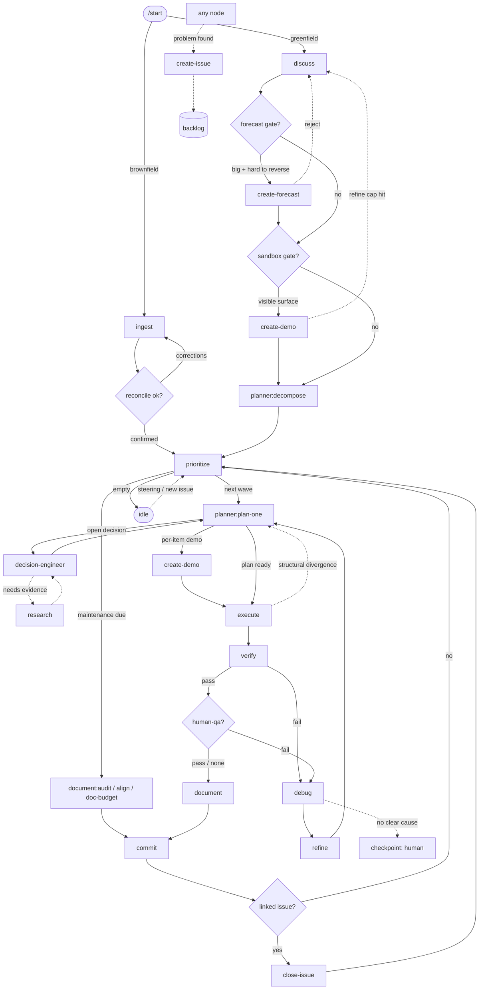

# Loop — the routing graph

The orchestrator reads this to route. **Topology is fixed** (it changes only with the package);
the live position lives in `state.json`. Nodes are skills/agents; edges are followed on a node's output.

## Routing table
| node | on output | next |
|---|---|---|
| `ingest` *(brownfield entry — `/start` routes here)* | knowledge graph + reconstructed spec built | `checkpoint:reconcile` |
| `checkpoint:reconcile` | reconstructed spec confirmed | `prioritize` |
| `checkpoint:reconcile` | corrections needed | `ingest` (re-run) / `discuss` |
| `discuss` | spec drafted | `create-forecast?` (forecast gate) |
| `create-forecast` | forecast approved (checkpoint pass) | `create-demo?` (sandbox gate) |
| `create-forecast` | gate not triggered | `create-demo?` (sandbox gate) |
| `create-demo` | demo approved (checkpoint pass) | `planner:decompose` |
| `create-demo` | gate not triggered | `planner:decompose` |
| `planner:decompose` | roadmap → backlog | `prioritize` |
| `prioritize` | next wave emitted | `planner:plan-one` (per item in the wave) |
| `prioritize` | maintenance due (retention, drift, or doc-size threshold) | `document:audit` / `align` / `doc-budget` |
| `prioritize` | backlog empty | `idle` (await steering) |
| `idle` | steering arrives / new backlog item (a `create-issue` side-door) | `prioritize` (re-pick) |
| `planner:plan-one` | open decisions | `decision-engineer` → back to `planner:plan-one` |
| `planner:plan-one` | plan ready, per-item sandbox gate fires (visible surface, underdetermined) | `create-demo` (per item) |
| `planner:plan-one` | plan ready, no per-item demo | `execute` |
| `decision-engineer` | needs evidence | `research` → back to `decision-engineer` |
| `create-demo` | demo approved (per-item checkpoint pass) | `execute` |
| `create-demo` | refine cap hit (`config.demo.max_refine_rounds`) — never auto-proceed | escalate → `discuss` (live realignment, carrying the refine history) |
| `execute` | changelog | `verify` |
| `execute` | structural divergence (the plan is wrong) | `planner:plan-one` (re-plan) |
| `verify` | **pass** | `checkpoint:qa?` |
| `verify` | **fail** | `debug` |
| `debug` | root cause | `refine` |
| `debug` | confidence stays < threshold after retries (no clear cause) | escalate → `checkpoint` (human) |
| `refine` | correction plan | `planner:plan-one` → `execute` |
| `checkpoint:qa` | pass (or no human-qa criteria → skip) | `document` |
| `checkpoint:qa` | fail | `debug` |
| `checkpoint:demo` | approve | lock the spec state → **prune the demo** → continue (`planner:decompose` at inception · `execute` per-item) |
| `checkpoint:demo` | changes | `create-demo` (refine the sandbox / spec — **keep** the bundle + its refine count) |
| `checkpoint:demo` | reject | `discuss` (→ **prune the demo**) |
| `checkpoint:forecast` | approve | **freeze the forecast** (before the unpark) → continue (`create-demo?`) |
| `checkpoint:forecast` | changes | `create-forecast` (re-forecast with the edits — the record stays a draft) |
| `checkpoint:forecast` | reject | `discuss` |
| `checkpoint:setup` | fail (couldn't complete) | re-attempt `checkpoint` (re-guides via setup-guide) / escalate to human |
| `document` | knowledge + Sessions updated | `commit` |
| `commit` | snapshot made | `close-issue?` |
| `close-issue` | issue closed (or no linked issue → skip) | `prioritize` (next item) |
| `document:audit` | retention pass done (changes staged) | `commit` |
| `align` | scan done (tickets filed via `create-issue`, fixes staged, anchor written) | `commit` |
| `doc-budget` | over-budget doc trimmed or split-and-pointered (changes staged) | `commit` |

<!-- Every side door must be named ON the line below: the contract linter reads only the line that
     starts with "Side doors", so a door introduced on a continuation line is silently unrouted. -->
Side doors (callable from anywhere): `create-issue` → backlog · `research` (service) · `answer` · `status`.
`answer` is entered from the boundary drain, never from a node — a question advances nothing, so it has no
edge. `status` is the same shape: a pure read of where the project is, mutating nothing and returning to
wherever it was called from.

**The gated rows (`create-demo?`) are the router's call, before any dispatch** — default **no demo**, decided
per work-item. Its three conditions live once in the `create-demo` capability's *sandbox gate* section: read
them there (this file is read every turn; that one is not).

## Scheduler boundary — the inbox drain
Between items (and before any pick) the orchestrator **drains `.workflow/inbox/`** — the console's typed
messages to the loop. This is **plain control-flow, not a node**: no skill runs and no edge is followed, so it
appears nowhere in the table above. Order within one boundary:

`drain (skip already-consumed ids) → apply control → resume a ready-parked ticket (oldest verdict first, +aging)
→ promote intake → start-new → fire release → answer questions → sleep`

What each kind does at the boundary, and the anchor that makes a repeat a no-op:
- **verdict** — resumes the parked ticket whose `token` matches; an unknown or already-closed token → dead-letter
  and surface it. The ticket is then closed with `bus.py unpark --id <ticket_id>`, which removes the record and
  re-projects `handoff.md`'s parked block. *Anchor:* the token itself (already closed → no-op) — and "closed" means
  the record is gone, which is why `unpark` is the step that makes the anchor real.
- **intake** — promoted into `backlog.md` through triage, stamped with the source message id. *Anchor:* that stamp
  (an item already carrying the id is already promoted → skip).
- **control** — reprioritize / pause, honored here only (non-preemptive; never mid-item). *Anchor:* none possible,
  so control ops are required to be idempotent.
- **release** — fires the named `outbox/` entries through `guard.sh`. *Anchor:* the entry's status (already fired
  → skip).
- **question** — run `answer`: reply from this project's own record and append the turn to
  `.workflow/thread/thread.json`. *Anchor:* that turn's source message id (a reply already carrying it → skip).
  **Last, and it advances nothing** — a question is a read, so it never delays a parked resume or a promotion,
  and it must never be promoted into the backlog on its own.

A parked ticket resumes **only** via this drain. The consumer **never deletes** an inbox file (the bus owns that
directory and collects consumed messages itself).

**Forecast divergence check — here and nowhere else.** If the item being picked has a frozen
`.workflow/forecasts/<id>.json`, run it before starting work:
```bash
python3 .claude/scripts/forecast.py reality .workflow/forecasts/<id>.json \
  --workflow-dir .workflow --check
```
A non-zero exit means the loop reached a node the approved chain never predicted — a **structural** divergence.
Do not walk on: re-run `create-forecast` for the remaining tail and re-show it, so the human is re-consulted on a
route they never agreed to. Reality is **derived** from the anchor table (`schemas.md § the forecast ANCHOR
TABLE`), so there is nothing to record and nothing to keep in step.

**This fires at the boundary ONLY, never mid-item** — that is what keeps `prioritize`'s non-preemption and the
never-stall rule intact, and it is why this is plain control-flow here rather than a routing edge in the table
above. A divergence found mid-item is not lost; it is picked up at the next boundary, which is the first moment
the loop is allowed to change its mind anyway.

**The drain is split, and the split is the point.** *Which* messages are new, in what order they apply, what the
watermark is now, and what may be pruned are all a pure function of the inbox and `handoff.md` — that half is
`drain.py`'s (`list` → apply → `record`), and it is not re-derived by hand. *Applying* a message is judgment —
which ticket a verdict resumes, whether an ask is worth promoting and at what priority, how a rejection routes —
and that half stays here. `record` recomputes `consumed_through` (the low-watermark: every message at or below it
is consumed, so the bus may collect it) and **prunes the consumed-set to ids above it**, which is what keeps
`handoff.md` bounded — a cold start reads that file whole.

## Stack-wiring at tech_stack lock
A greenfield project starts with an empty product tree, so `/start` cannot detect a stack and writes only the
**coverage-only** `checks.env` + the unspecialized `rules/` baseline. The stack is chosen later, by
`decision-engineer` resolving the spec's `tech_stack` (a `TBD → decision-engineer` pointer). **The moment that
resolution flips `tech_stack` to `locked` while `.workflow/checks.env` still wires no stack gate, run the
stack-wiring step** (the stack-dependent half of `/start` step 5) before the next `execute`:
- fill `.workflow/checks.env` with the concrete `FMT_CHECK`/`LINT`/`TYPECHECK`/`TEST` (+ `FMT_FIX`/`LINT_FIX`)
  commands for the chosen stack, **scoped to `project_root`**;
- specialize each `rules/` `— enforced by:` tag to the concrete tool, and wire the enforcers (formatter, linter,
  typechecker, test runner, CI) — gap-fill, never clobber;
- add the stack's build-output paths to `.gitignore`; regenerate the code map.

This is a **one-time transition** (stack `unspecified/TBD → locked`), not a per-item step — it is the orchestrator's
to run, so the leaf skills stay in their lane. It is a positive fast-path: `checks.sh --check` **fails the commit
closed** whenever source exists under `project_root` with no stack gate wired, so skipping this step cannot silently
disarm the gate — it stops the loop loudly until the stack is wired.

**Skip this entirely when `checks.env` sets `STACK_GATE_NONE`** — a tree whose code must never be executed here is
*declared*, not unwired, and is already transitioned. Wiring commands into it re-arms `eval` on foreign code; the
runner refuses them and reports the conflict, so the attempt is noise, not a fix.

## Maintenance items
`prioritize` injects a **maintenance item** on a threshold (§ `prioritize`): a *retention/size* threshold →
`document:audit` (bound the append-only tier); a *drift* threshold → `align` (reconcile spec/decisions/promises
vs code); a *doc-size* advisory → `doc-budget` (trim or split-and-pointer a context-loaded doc that has grown
past its role's budget — the hard tier is already enforced on the commit gate, so only advisories arrive here).
A maintenance item is **self-contained**: it runs its own pass and flows straight to `commit` — there
is no `planner`/`execute`/`verify`, because there is no product-code change to plan and no runtime behaviour to
verify — then `close-issue?` (skip: no linked issue) → `prioritize`. `align`'s *semantic* findings leave as
ordinary `create-issue` tickets (the side-door) and ride the normal queue; only its mechanical auto-fixes + the
new scan anchor ride this commit. The three thresholds are **decoupled** — memory pressure ≠ drift risk ≠ doc
size, and one shared threshold would make each of them fire for another's reason.

## Item-complete tail
`verify`(pass) → `checkpoint:qa?` → `document` → `commit` → `close-issue?` → `prioritize`.
The item's backlog done-flip and the `handoff.md` rewrite happen **before** `commit` (it captures them);
`close-issue` is the only post-commit step.

## Diagram

