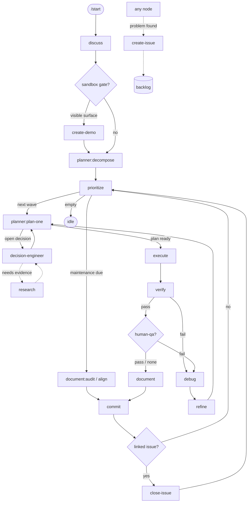

# Loop — the routing graph

The orchestrator reads this to route. **Topology is fixed** (it changes only with the package);
the live position lives in `state.json`. Nodes are skills/agents; edges are followed on a node's output.

## Routing table
| node | on output | next |
|---|---|---|
| `discuss` | spec drafted | `create-demo?` (sandbox gate) |
| `create-demo` | demo approved (checkpoint pass) | `planner:decompose` |
| `create-demo` | gate not triggered | `planner:decompose` |
| `planner:decompose` | roadmap → backlog | `prioritize` |
| `prioritize` | next wave emitted | `planner:plan-one` (per item in the wave) |
| `prioritize` | maintenance due (retention or drift threshold) | `document:audit` / `align` |
| `prioritize` | backlog empty | `idle` (await steering) |
| `planner:plan-one` | open decisions | `decision-engineer` → back to `planner:plan-one` |
| `planner:plan-one` | plan ready | `execute` |
| `decision-engineer` | needs evidence | `research` → back to `decision-engineer` |
| `execute` | changelog | `verify` |
| `verify` | **pass** | `checkpoint:qa?` |
| `verify` | **fail** | `debug` |
| `debug` | root cause | `refine` |
| `refine` | correction plan | `planner:plan-one` → `execute` |
| `checkpoint:qa` | pass (or no human-qa criteria → skip) | `document` |
| `checkpoint:qa` | fail | `debug` |
| `document` | knowledge + Sessions updated | `commit` |
| `commit` | snapshot made | `close-issue?` |
| `close-issue` | issue closed (or no linked issue → skip) | `prioritize` (next item) |
| `document:audit` | retention pass done (changes staged) | `commit` |
| `align` | scan done (tickets filed via `create-issue`, fixes staged, anchor written) | `commit` |

Side doors (callable from anywhere): `create-issue` → backlog · `research` (service).

## Maintenance items
`prioritize` injects a **maintenance item** on a threshold (§ `prioritize`): a *retention/size* threshold →
`document:audit` (bound the append-only tier); a *drift* threshold → `align` (reconcile spec/decisions/promises
vs code). A maintenance item is **self-contained**: it runs its own pass and flows straight to `commit` — there
is no `planner`/`execute`/`verify`, because there is no product-code change to plan and no runtime behaviour to
verify — then `close-issue?` (skip: no linked issue) → `prioritize`. `align`'s *semantic* findings leave as
ordinary `create-issue` tickets (the side-door) and ride the normal queue; only its mechanical auto-fixes + the
new scan anchor ride this commit. The two thresholds are **decoupled** — memory pressure ≠ drift risk.

## Item-complete tail
`verify`(pass) → `checkpoint:qa?` → `document` → `commit` → `close-issue?` → `prioritize`.
The item's backlog done-flip and the `handoff.md` rewrite happen **before** `commit` (it captures them);
`close-issue` is the only post-commit step.

## Diagram

